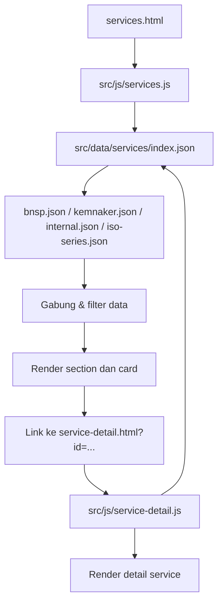

# Mekanisme Service di Project Ini

Dokumen ini menjelaskan bagaimana fitur service bekerja di project landing page ini, mulai dari struktur HTML, pengambilan data JSON, sampai proses render di JavaScript.

## Gambaran Singkat

Alur utamanya adalah:

1. Halaman `services.html` menampilkan struktur dasar halaman service.
2. JavaScript di `src/js/services.js` mengambil data dari folder `src/data/services/`.
3. Data JSON digabungkan, difilter, lalu diubah menjadi section dan card service.
4. Setiap card mengarah ke `service-detail.html?id=...`.
5. `src/js/service-detail.js` membaca parameter `id`, mengambil data JSON yang sama, lalu merender detail service yang sesuai.

## File Yang Terlibat

### HTML

- [services.html](services.html)
- [service-detail.html](service-detail.html)

### JavaScript

- [src/js/services.js](src/js/services.js)
- [src/js/service-detail.js](src/js/service-detail.js)

### Data JSON

- [src/data/services/index.json](src/data/services/index.json)
- [src/data/services/bnsp.json](src/data/services/bnsp.json)
- [src/data/services/kemnaker.json](src/data/services/kemnaker.json)
- [src/data/services/internal.json](src/data/services/internal.json)
- [src/data/services/iso-series.json](src/data/services/iso-series.json)

## Mekanisme di Halaman Services

### 1. HTML menyediakan struktur dasar

File [services.html](services.html) berisi layout utama halaman, seperti hero section, navigasi kategori, filter sertifikasi, dan section-section statis yang sudah ditulis langsung di HTML.

Halaman ini juga memuat script [src/js/services.js](src/js/services.js) yang bertugas menambahkan konten dinamis ke dalam `<main>`.

### 2. JavaScript mengambil data JSON

Di [src/js/services.js](src/js/services.js), script berjalan secara async dan melakukan langkah berikut:

- mengambil file konfigurasi halaman,
- mengambil [src/data/services/index.json](src/data/services/index.json) untuk mendapatkan daftar file service,
- memuat semua file JSON service yang ada di folder `src/data/services/`,
- menggabungkan semua service menjadi satu array.

Struktur `index.json` hanya berisi daftar nama file, misalnya `bnsp`, `kemnaker`, `internal`, dan `iso-series`. File-file itu lalu di-fetch satu per satu.

### 3. Data digabung dan difilter

Setelah semua file JSON berhasil dimuat, `services.js` melakukan flatten terhadap seluruh `services` dari setiap file.

Lalu data difilter berdasarkan konfigurasi section, misalnya:

- `categoryFilters` untuk kategori seperti `k3`, `iso`, `bnsp`,
- `certificationFilters` untuk jenis sertifikasi seperti `bnsp`, `kemnaker`, `internal`.

Hasil filter inilah yang dipakai untuk membangun tampilan section tertentu.

### 4. JavaScript membangun HTML secara dinamis

`services.js` punya beberapa generator tampilan:

- `generateGridSection()` untuk grid card standar,
- `generateImageGridSection()` untuk tampilan bergambar,
- `generateBannerSection()` untuk banner besar,
- `generateBannerWithGridSection()` untuk banner dengan grid tambahan.

Setiap service card dibuat lewat `generateCard()`, lalu ditambahkan atribut seperti `data-cert` agar filter sertifikasi bisa bekerja di UI.

### 5. Konten disisipkan ke halaman

Kontainer dinamis dibuat dengan `document.createElement('div')`, lalu dimasukkan ke `<main>`.

Jika ditemukan section yang cocok sebagai penanda posisi, konten disisipkan sebelum section tersebut. Jika tidak, kontainer ditempel di akhir `<main>`.

### 6. Interaksi filter dan hover

Masih di [src/js/services.js](src/js/services.js), event listener ditambahkan untuk:

- tombol filter sertifikasi,
- efek hover pada card.

Filter yang aktif akan membuat card yang tidak cocok menjadi redup dan nonaktif secara pointer.

## Mekanisme ke Detail Service

### 1. Link dari card menuju detail

Setiap card service membentuk URL seperti:

`service-detail.html?id=iso-9001`

Nilai `id` ini adalah kunci utama untuk mencari data service yang benar.

### 2. Halaman detail membaca parameter URL

Di [service-detail.html](service-detail.html), halaman menyediakan skeleton loader dan container kosong untuk konten detail.

Script [src/js/service-detail.js](src/js/service-detail.js) kemudian membaca query string `?id=` dari URL.

### 3. Data diambil dari sumber yang sama

`service-detail.js` memuat [src/data/services/index.json](src/data/services/index.json), lalu mengambil semua file JSON yang terdaftar di dalamnya.

Semua service dari semua file digabung menjadi satu array, lalu dicari service yang `id`-nya sama dengan parameter URL.

### 4. Detail dirender sesuai data service

Jika service ditemukan, script akan:

- mengubah judul halaman,
- menghapus skeleton loader,
- mengisi container detail dengan HTML hasil `buildDetailHTML(service)`,
- mengaktifkan kembali animasi reveal,
- menyiapkan modal brosur jika `brochureUrl` tersedia.

Jika service tidak ditemukan, halaman menampilkan pesan error yang mengarahkan kembali ke halaman services.

## Format Data JSON

Setiap file JSON service di folder `src/data/services/` menyimpan array object service. Field yang umum dipakai antara lain:

- `id`
- `category`
- `categoryLabel`
- `badge`
- `certifications`
- `title`
- `subtitle`
- `icon`
- `heroColor`
- `duration`
- `method`
- `certificate`
- `level`
- `description`
- `objectives`
- `syllabus`
- `includes`
- `targetParticipants`
- `brochureUrl`
- `contactUrl`

Field-field itu dipakai untuk dua hal:

- tampilan ringkas di halaman services,
- tampilan lengkap di halaman detail.

## Catatan Penting

Ada satu hal yang perlu diperhatikan di implementasi saat ini: [src/js/services.js](src/js/services.js) mencoba memuat `src/data/services-page-config.json`, tetapi file itu belum ada di workspace.

Artinya, jika file itu memang belum dibuat di project asli, halaman services dinamis bisa gagal di tahap awal fetch. Kalau memang ingin section services dibentuk penuh dari JSON, file konfigurasi itu perlu ditambahkan atau path fetch-nya disesuaikan ke file yang benar.

## Ringkasan Alur

## Kesimpulan

Intinya, service di project ini bekerja dengan pola data-driven: HTML menyediakan kerangka halaman, JSON menyimpan isi service, dan JavaScript bertugas mengambil data lalu membangun UI secara dinamis. Halaman listing dan halaman detail memakai sumber data yang sama, sehingga relasi antarhalaman tetap konsisten melalui `id` service.
